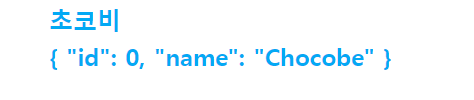

# Vue3 스터디 - (코지코더 강좌)

``Vue3`` 에서는 2가지의 컴포넌트 작성 방법을 지원하고 있습니다.
* ``Vue Options``: ``Vue2`` 의 방식
* ``composition-api``: ``setup()`` 을 사용한 컴포넌트 작성 방식

이 프로젝트는 ``Composition-API`` 를 사용하여 컴포넌트를 작성하는 방식으로 스터디 합니다.


<br/><hr/><br/>


## 01. ``App.vue`` 렌더링

``Vue2`` 와는 달리, ``createApp()`` 함수를 사용하여 ``App.vue`` 를 렌더링 합니다.

```javascript
// main.js

import { createApp } from "vue";
import App from "./App.vue";

createApp(App).mount("#app");
```

<br/>

또한 ``createApp()`` 으로 만든 ``Vue`` 객체는 ``Builder`` 패턴이 적용되어, 다음과 같이 초기화 할 수 있습니다.

```javascript
import { createApp } from "vue";
import App from "./App.vue";
import router from "./router";
import store from "./store";

createApp(App)
  .use(router)
  .use(store)
  .mount("#App");
```


<br/><hr/><br/>


## 02. ``<template>`` 변경점

``Vue2`` 에서는 ``<template>`` 에 루트 요소에 묶인 형식으로 작성 하였습니다.

```html
<template>
  <div class="component-root">
    ...
  </div>
</template>
```

<br/>

``Vue 3`` 에서는 이부분이 변경 되어, 루트 요소 없이 사용할 수 있게 되었습니다.

```html
<template>
  <div class="el-1"></div>

  <div class="el-2">
    <div class="el-2-1"></div>
    <div class="el-2-2"></div>
  </div>

  ...
</template>
```


<br/><hr/><br/>


## 03. ``setup()``

``Vue3`` 에서 가장 큰 변화는 ``composition-api`` 입니다.

``Vue2`` 의 기본 문법이었던 ``Options`` 방식과 달리, ``setup()`` 함수에서 반환하는 객체가 ``컴포넌트 속성`` 이 됩니다.

```html
<template>
  <div class="name">
    {{ greet }}
  </div>
</template>

<script>
export default {
  setup() {
    const name = "Chocobe";
    const greeting = name => `Hello, ${name}`;

    const greet = greeting(name);

    return {
      greet,
    };
  },
};
</script>
```


<br/><hr/><br/>


## 04. ``ref`` 와 ``reactive``

``Vue2`` 에서 제공했던 ``data`` 와 ``method`` 는, ``Vue3`` 의 ``setup()`` 에서 반환시켜 만들 수 있습니다.

<br/>

``method`` 의 경우는 ``setup()`` 에서 함수객체를 반환하는 것으로 만들 수 있습니다.

```html
<script>
export default {
  setup() {
    const onClick = () => console.log("Hello World");

    return { onClick };
  },
};
</script>
```

<br/>

``data`` 의 경우는 ``Vue3`` 에서 제공하는 2개의 함수를 사용하여 만들 수 있습니다.

* ``ref()`` 함수
* ``reactive()`` 함수

<br/>

``data`` 를 만드는데 2개의 함수를 제공하는 이유는 다음과 같습니다.

* ``ref()`` 함수는 모든 타입 (리터럴, 객체, 배열) 을 만들 수 있습니다.
* ``reactive()`` 함수는 객체, 배열만 만들 수 있습니다.
* ``ref()`` 로 만든 ``data``는 ``.value`` 속성을 통해서만 실제 값(참조값)에 접근할 수 있습니다.
* ``reactive()`` 는 바로 값을 접근할 수 있습니다. (``.value`` 속성 없음)

<br/>

만약, ``ref()`` 나 ``reactive()`` 를 사용하지 않는다면, ``<template />`` 에서 값의 변화를 ``감지할 수 없습니다.``

<br/>

```html
<template>
  <div class="name">{{ name }}</div>
  <div class="user">{{ user }}</div>
</template>

<script>
import { ref, reactive } from "vue";

export default {
  setup() {
    const name = ref("초코비");

    const user = reactive({
      id: 0,
      name: "Chocobe",
    });

    return {
      name,
      user,
    };
  },
};
</script>
```

<br/>

<br/>


<br/><hr/><br/>


## 05. 메서드와 이벤트

``setup()`` 에서 정의한 함수를 ``return`` 해주면 됩니다.

``<template />`` 에서의 이벤트 등록 방법은 ``Vue2`` 와 동일 합니다.

```html
<template>
  <button @click="onClick">버튼</button>
</template>

<script>
export default {
  setup() {
    const onClick => () => console.log("Hello World");

    return {
      onClick,
    };
  },
};
</script>
```


<br/><hr/><br/>


## 06. 
